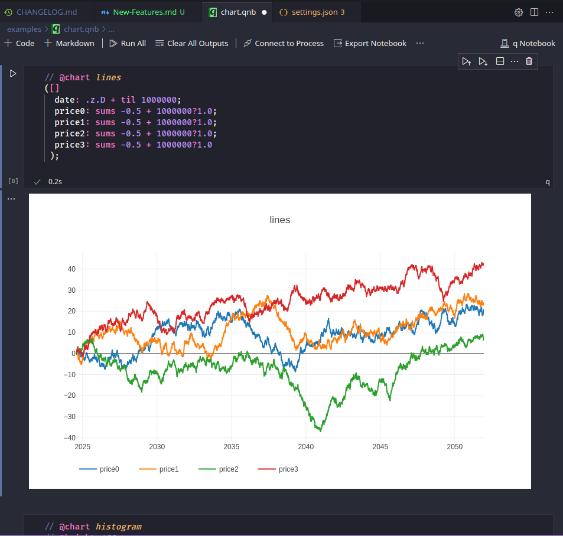
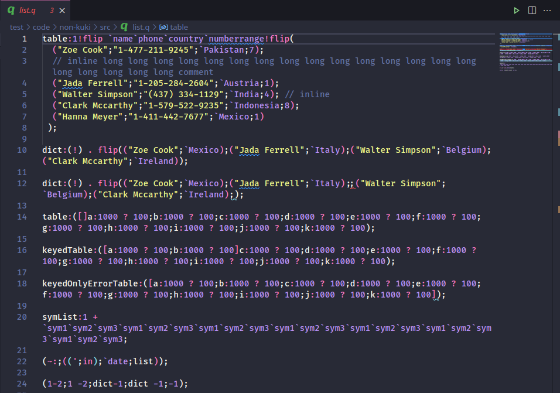
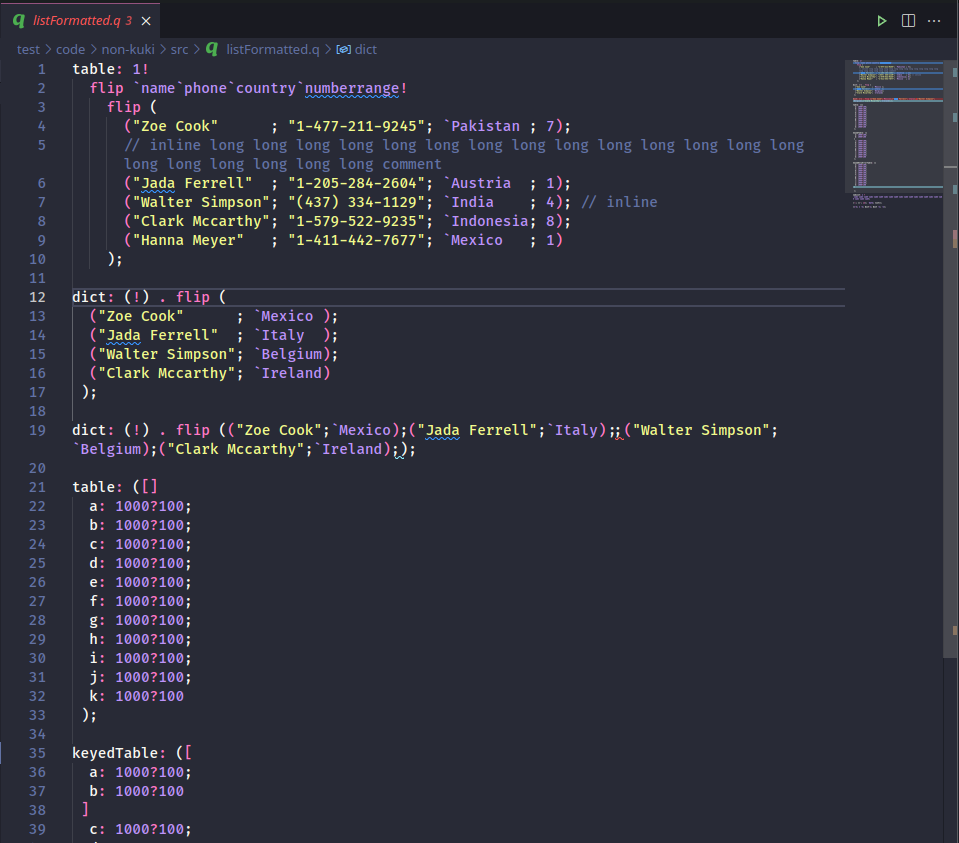

# New Features (k-pro only)

## Query Performance

use high-performance javascript interface [jkdb](https://github.com/jshinonome/jkdb) to kdb+/q, up to 10 times faster than vscode-q

## Grid Mode

- pop up for long text
- use a better chart package [plotly](https://plotly.com/javascript/) for charting
- support more chart types

## q Notebook

`.qnb` file type is treated as q notebook in vscode. open the following file in vscode

- [chart](examples/chart.qnb), put `// @chart lines|histogram|scatter|bar` as the first line
  

## q Syntax

- more accurate

## q Language Server

- call hierarchy
- linter
- formatter
  - `ctrl+shift+p` and search "Format Document"
  - turn on auto format, `ctrl+shift+p` and search "Open User Settings(JSON)", and add the following lines

```json
    "[q]": {
        "editor.tabSize": 2,
        "editor.formatOnSave": true
    },
```

before formatting


after formatting


## Discovery Server

- retain connections and remove processes
- auto refresh discovery server
- auto disconnect prod discovery server
